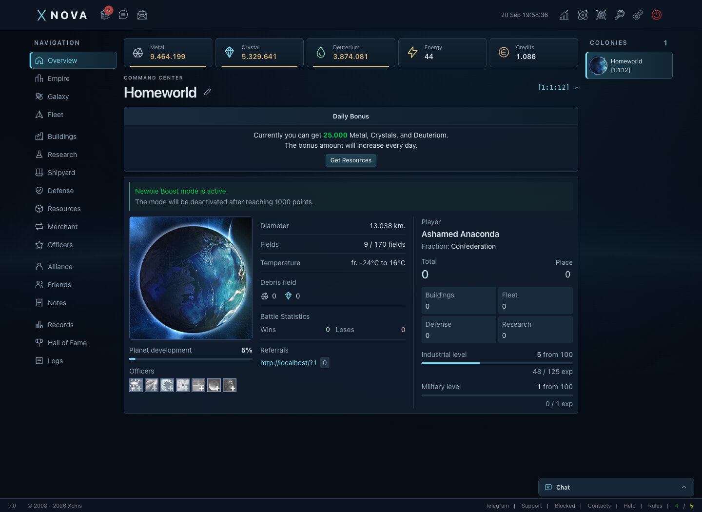
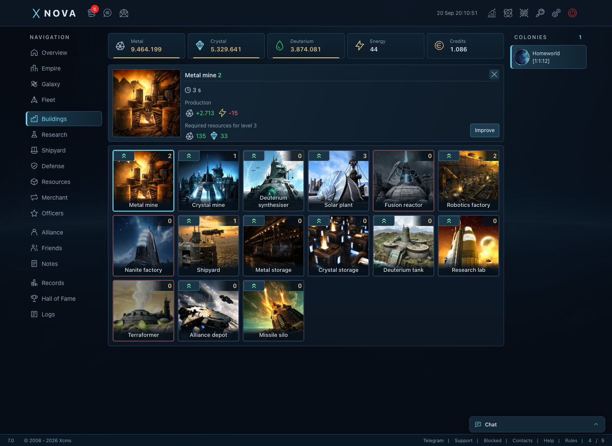
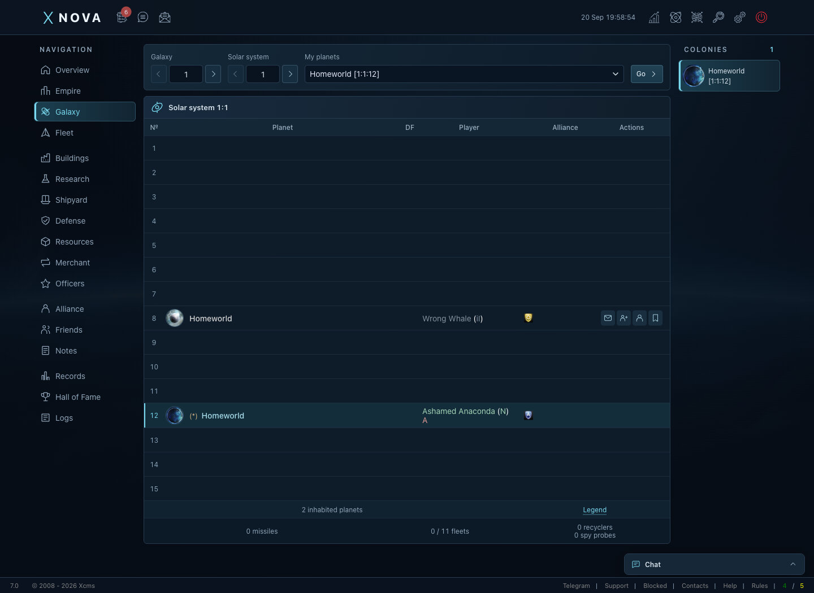
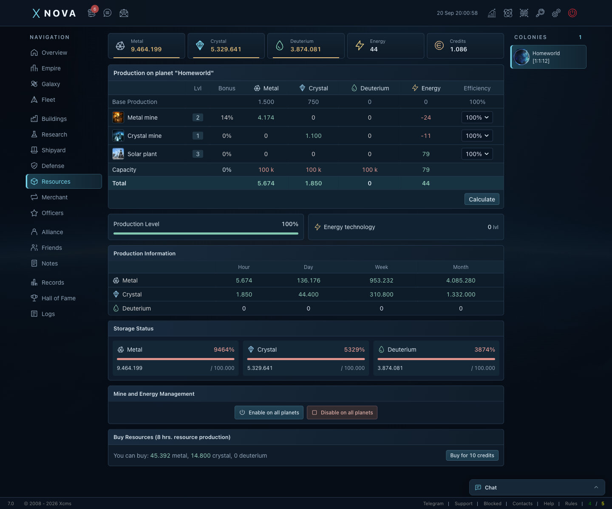

# Xnova

Xnova is a browser-based space strategy game inspired by classic OGame. Build a planetary empire, research technologies, command fleets, and form alliances in a persistent universe.

The application uses Laravel and Vue, connected through Inertia, with a Filament administration panel and Laravel Reverb for real-time communication.

## Features

- Planet management, resource production, buildings, and research.
- Shipyards, defenses, fleet missions, and a combat simulator.
- Galaxy exploration, colonization, and empire management.
- Alliances, diplomacy, private messages, and chat.
- Quests, player rankings, statistics, and battle reports.
- Administration tools for players, planets, fleets, and game settings.

## Screenshots

### Planet overview



### Construction



### Galaxy exploration



### Resource management



## Technology stack

| Layer | Technologies |
| --- | --- |
| Backend | PHP 8.5, Laravel 13 |
| Frontend | Vue 3, Inertia 3, Vite 8, Tailwind CSS 4 |
| Administration | Filament 5 |
| Real-time communication | Laravel Reverb, Laravel Echo |
| Database | MySQL; SQLite for tests and the local Docker setup below |
| Development tools | Pest, PHPStan, Larastan |
| Docker runtime | FrankenPHP, Node.js 24, Redis |

## Requirements

For a native installation:

- PHP 8.5 with the extensions listed in [composer.json](composer.json), plus the PDO driver for your database.
- Composer 2.
- Node.js 24 or newer and npm.
- MySQL 8.0 or newer, with a database and user created for the application.
- Redis when using Redis-backed queues or caching.

Combat calculations use PHP FFI and load `storage/libbattle_engine_ffi.so` on Linux or `storage/libbattle_engine_ffi.dylib` on macOS. The bundled macOS library targets Apple Silicon. Run `./rust/build.sh` to rebuild for the host platform. The library architecture must match PHP, and the runtime must allow FFI calls (`ffi.enable=true` for web requests). A custom absolute library path can be set with `BATTLE_ENGINE_LIBRARY`.

For the Docker setup, install Docker with the Compose plugin. PHP, Composer, and Node.js run inside the containers.

## Getting started with Docker

Run the following commands from the repository root on a fresh checkout:

```sh
cp .env.example .env
touch database/database.sqlite
```

The Compose stack includes the web server, SSR server, Reverb, queue worker, scheduler, game daemon, and Redis. It does not include MySQL. This local setup uses the SQLite connection from `.env.example`.

Update these values in `.env` before building the assets:

```dotenv
APP_ENV=local
APP_URL=http://localhost:8000
DB_CONNECTION=sqlite
DB_DATABASE=/app/database/database.sqlite
REDIS_HOST=redis
REVERB_HOST=reverb
REVERB_PORT=8080
REVERB_SCHEME=http
VITE_REVERB_HOST=localhost
VITE_REVERB_PORT=8000
VITE_REVERB_SCHEME=http
```

The application connects to Reverb through the Compose network. Browser connections use the web server's proxy on port `8000`, so the `VITE_REVERB_*` values use the browser-facing address.

Install dependencies and initialize the application before starting the services:

```sh
cd docs/docker
docker compose build
docker compose run --rm --no-deps backend composer setup
docker compose run --rm --no-deps backend php artisan storage:link
docker compose up -d
```

Open [localhost:8000](http://localhost:8000). The administration panel is available at [localhost:8000/admin](http://localhost:8000/admin).

To use MySQL instead, configure the `DB_*` values for a server reachable from the containers and ensure the PHP image has the `pdo_mysql` extension. Use `host.docker.internal` when connecting to a database on the host machine.

Useful commands, run from `docs/docker/`:

```sh
docker compose logs -f backend daemon
docker compose exec backend php artisan migrate
docker compose exec backend npm run build:ssr
docker compose down
```

## Native installation

Copy the environment file from the repository root:

```sh
cp .env.example .env
```

Configure the application URL and your MySQL connection in `.env`:

```dotenv
APP_ENV=local
APP_URL=http://localhost:8000
DB_CONNECTION=mysql
DB_HOST=127.0.0.1
DB_PORT=3306
DB_DATABASE=xnova
DB_USERNAME=xnova
DB_PASSWORD=your-local-password
```

Initialize the application:

```sh
composer setup
php artisan storage:link
composer dev
```

`composer setup` installs PHP and JavaScript dependencies, generates the application key, runs migrations and seeders, and builds the frontend and SSR bundles. Use it for initial setup; it regenerates the application key when run again.

`composer dev` starts the local web server, a scheduler invocation, queue listener, Reverb, game daemon, log viewer, and Vite. Open [localhost:8000](http://localhost:8000).

The development script calls `schedule:run` once. To keep scheduled tasks running during development, run this in a separate terminal:

```sh
php artisan schedule:work
```

To run the built SSR bundle outside Docker:

```sh
php artisan inertia:start-ssr
```

## Default administrator

On a fresh database, the seeders create an administrator with a developed planet and starter fleet:

| Field | Value |
| --- | --- |
| Email | `admin@admin.com` |
| Password | `password` |

Change these credentials before exposing the application publicly.

## Development commands

Run these commands from the repository root. For builds and checks in Docker, prefix the command with `docker compose exec backend` from `docs/docker/`; the Compose services already run the background processes.

| Command | Purpose |
| --- | --- |
| `composer dev` | Start the native development processes |
| `npm run dev` | Start the Vite development server |
| `npm run build` | Build frontend assets |
| `npm run build:ssr` | Build frontend assets and the SSR bundle |
| `composer test` | Run the Pest test suite |
| `composer analyse` | Run PHPStan and Larastan |
| `php artisan game:daemon` | Process fleet events and game queues |

## Game configuration

Game rules are defined in [config/game.php](config/game.php). Common speed multipliers can be changed in `.env`:

| Variable | Purpose | Example value |
| --- | --- | --- |
| `GAME_BASE_SPEED` | Building and research speed | `50` |
| `GAME_RESOURCE_SPEED` | Resource production speed | `50` |
| `GAME_FLEET_SPEED` | Fleet travel speed | `50` |
